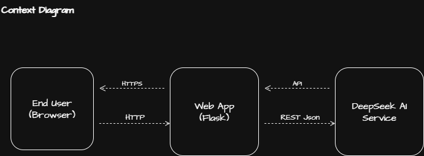
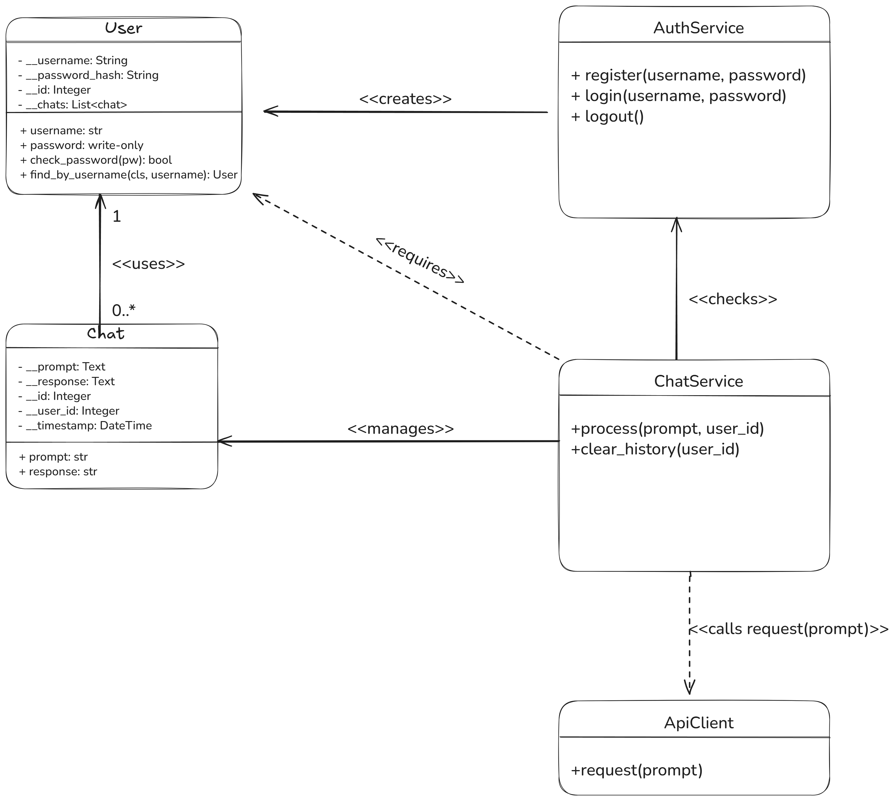
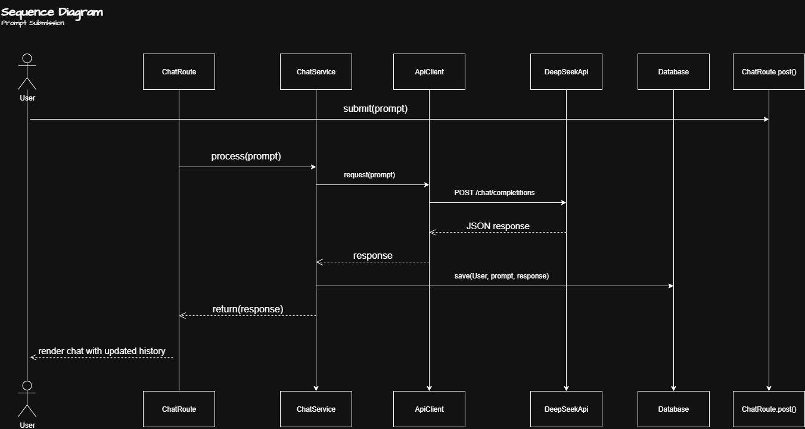
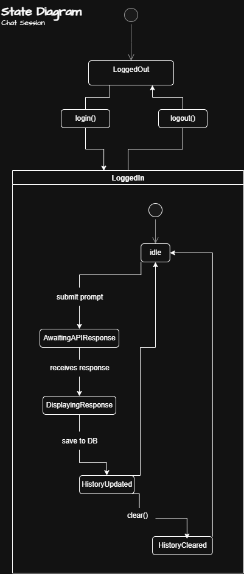
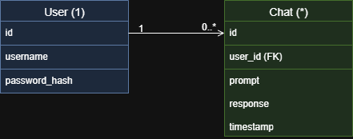

# Analysis and Design Document (ADD) for AIFacade Application

---

## 1. Document Control

__TO DO__: Update the document control fields. The date needs to be updated.

- **Version:** 1.0
- **Date:** 2025-06-30
- **Authors:** Bicu Andrei Ovidiu
- **Status:** Final

---

## 2. Introduction

2.1 **Purpose**

The Analysis and Design Document describes the system’s architecture, key components, data flows, and design decisions. It provides detailed UML diagrams and rationale to guide development and future enhancements.

2.2 **Scope**

This document details the architectural and design blueprint for the AIFacade application. It explains the system structure, component interactions, and the rationale behind key design decisions to guide development, scalability, and future enhancements.

---

## 3. Requirements Analysis

3.1 **Functional Requirements** (excerpt)

AIFacade is fundamentally designed to cater to the requirements of authorized and authenticated users who engage with an AI system. Its architecture focuses on ensuring seamless interaction, prioritizing user experience, and enhancing the overall efficiency of AI-driven tasks. By addressing the specific needs of these users, AIFacade aims to create a robust platform that facilitates effective collaboration between humans and AI, enabling users to leverage the potential of artificial intelligence in their workflows fully. The user journey begins with secure user registration and authentication, relying on hashed passwords to ensure sensitive information is never exposed. Once inside, users submit prompts, receive AI responses, and see their conversation unfold inline on a single page—mirroring the elegance of a chat app with none of the overhead.

Users can also clear their chat history entirely, which removes not just the messages but the context, freeing them to start anew. In rare moments when things go wrong, such as accessing a nonexistent route or encountering an internal error, custom pages appear to gently redirect users without breaking immersion.

3.2 **Non-Functional Requirements**

Behind the scenes, several essential guarantees shape the experience. Security measures, such as CSRF tokens and strict HTTP headers, protect every form submission and interaction. To prevent abuse and ensure fair usage, the system applies rate limits to prompt submissions. The UI, while optimized for desktop experiences, is built using Bootstrap to allow some measure of responsiveness. Throughout the codebase, design decisions prioritize maintainability, as evidenced by the clean separation of modules and a testing regime that aims for near-complete coverage.

At its core, AIFacade is built around the needs of any authorized and authenticated user interacting with an AI system. Behind the scenes, several essential guarantees shape the experience. Security measures such as CSRF tokens and strict HTTP headers protect every form submission and interaction. To combat classical security threats like SQL injection, the system implements parameterized queries and input validation to ensure data integrity and prevent unauthorized access. Additionally, to avoid abuse and maintain fair usage, the system applies rate limits on prompt submissions. The UI, while optimized for desktop experiences, is built using Bootstrap to allow some measure of responsiveness. Throughout the codebase, design decisions prioritize maintainability, as evidenced by the clean separation of modules and a testing regime that aims for near-complete coverage.

## 4. System Overview

4.1 **Context Diagram**

Imagine the user sitting behind a browser, interacting over HTTPS with a Flask-powered web app. This app, in turn, acts as a trusted proxy to the DeepSeek API—a powerful language model backend. The communication flows in a loop: the user submits prompts, the app relays them to the AI, and responses come streaming back through the interface. Every interaction is framed by this triangle of trust: User ↔ Web App ↔ DeepSeek.

```plaintext
+-------------+     HTTPS     +------------+     API      +-------------+
|             |<-------------->|            |<------------>|             |
|  End User   |                |  Web App   |              | DeepSeek AI |
| (Browser)   |--------------->| (Flask)    |------------->|   Service   |
+-------------+    HTTP        +------------+   REST JSON  +-------------+
```



4.2 **Key Scenarios**

The most common journey begins with the user registering and logging in. From there, they engage with the chat interface, submitting prompts and reviewing responses. Over time, as the list of chats grows, they may decide to clear their history entirely. Eventually, they log out, closing the loop. In parallel, an alternative path might unfold—perhaps the DeepSeek API fails temporarily, in which case the user is shown a friendly error and offered a choice: try again or wait. Either way, the app remains stable and polite.

## 5. Static Design

5.1 **Class Diagram**



The data model driving AIFacade is elegantly simple. Users are represented as distinct entities with an ID, a unique username, and a hashed password. Each user can have many chats—each chat a record of a prompt, a response, and the moment it happened. This one-to-many relationship forms the spine of the system.

Around this backbone are three essential service classes. AuthService manages everything from login to logout. ChatService handles the flow of prompts and chat records. The ApiClient acts as the liaison with DeepSeek AI, carefully managing both outbound requests and inbound responses.

*Summary:*

- `User` with attributes `id`, `username`, `password_hash`.
- `Chat` with attributes `id`, `user_id`, `prompt`, `response`, `timestamp`.
- `AuthService`, `ChatService`, and `ApiClient` classes for business logic.

**TO DO** All attributes of a class must be private for security reasons. In the class diagram, still exist public variables (marked with + and not -)

5.2 **Package/Module Structure**

```plaintext
instance/
├── users.db
project/
├── static/
|      ├── style.css
├── templates/
|      ├── errors/
|      |      ├── 404.html
|      |      ├── 505.html
|      ├── base.html
|      ├── index.html
|      ├── login.html
|      ├── register.html
├── auth.py
├── chat.py
├── models.py
├── db.py
├── extensions.py
|── utils.py
|── config.py
└── __init__.py
```

---

## 6. Dynamic Design

6.1 **Sequence Diagram: Prompt Submission**

When a user sends a prompt, the sequence begins. The request is routed to a POST route bound to the chat page. That request is then handed off to ChatService, which packages it and sends it to the DeepSeek API via ApiClient. The API responds with a structured JSON payload, which ChatService parses and commits to the database, linking it to the initiating user. The flow ends with the updated chat history being rendered and returned to the user’s screen. In seconds, a new interaction is complete, and the conversation grows.



6.2 **State Diagram: Chat Session**

From the moment the user first arrives, they exist in a "Logged Out" state. Upon logging in, they enter the "Logged In" state, which enables them to submit prompts and clear the chat history. Each prompt triggers a temporary state of "Awaiting API Response," which resolves into either "Displaying Response" or "History Updated." At any point, users can reset the state entirely by logging out, returning to where they began. This state machine ensures predictability and clarity throughout the interaction lifecycle.
We use Flask-Login to manage user authentication, tracking the login state via login_user(), logout_user(), and current_user (). The LoginManager is initialized once with a user_loader during app creation to restore sessions. Furthermore, if the user is not authenticated (unauthorized & unauthenticated), they won't be able to chat with the AI, as they will always be redirected to the login page unless authenticated.



---

## 7. Component and Design Interfaces

7.1 **AuthService**

The AuthService is responsible for all user authentication flows. Whether a user is registering for the first time or logging in with existing credentials, this service ensures that their password is securely hashed and their session is safely maintained using Flask-Login. It encapsulates complexity and handles edge cases gracefully, offering simple entry points like register, login, and logout.

7.2 **ChatService**

This is where the heart of the application beats. ChatService accepts new prompts, invokes the AI, stores each exchange in the database, and retrieves historical records to display inline. When a user decides to clear their history, this service ensures every trace is deleted cleanly and atomically.

7.3 **ApiClient**

The ApiClient serves as the translator between AIFacade and DeepSeek. It builds the request payload, sends it over HTTPS, and interprets the response. It also handles timeouts and errors, shielding the rest of the app from API volatility. In a sense, it's both the gatekeeper and the interpreter of external intelligence.

## 8. Data Design

8.1 **ER Diagram**

Beneath all abstractions lies a simple relational truth: each user can generate many chats, but every chat belongs to exactly one user. This clean one-to-many relationship not only simplifies queries but also makes cascade deletion straightforward—when a user clears their history, the system knows exactly what to remove.



8.2 **Schema Definition** (SQLAlchemy)

In code, this is expressed through two SQLAlchemy models. The User model defines identities with uniqueness and password constraints, while the Chat model stores raw interactions alongside timestamps. A relationship link bridges them, making retrieval efficient and deletion safe. Timezones are accounted for, and timestamps are generated in UTC by default, ensuring future compatibility and auditing.

```python
class User(db.Model):
    id = db.Column(db.Integer, primary_key=True)
    __username = db.Column("username", db.String(80), unique=True, nullable=False)
    __password_hash = db.Column("password_hash", db.String(128)), nullable=False)
    chats = db.relationship('Chat', backref='user', lazy=True, cascade='all, delete-orphan')

    @property
    def username(self):
        return self.__username
    
    @username.setter
    def username(self, username):
        if not username:
            raise ValueError("Username cannot be empty")
        self.__username = username

     @property
    def password(self):
        raise AttributeError("Password is write-only")

    @password.setter
    def password(self, password):
        self.__password_hash = generate_password_hash(password)
    
    def check_password(self, password):
        return check_password_hash(self.__password_hash, password)

    @classmethod
    def find_by_username(cls, username):
        return cls.query.filter(cls._User__username == username).first()
    
class Chat(db.Model):
    id = db.Column(db.Integer, primary_key=True)
    user_id = db.Column(db.Integer, db.ForeignKey('user.id'), nullable=False)
    __prompt = db.Column("prompt", db.Text, nullable=False)
    __response = db.Column("response", db.Text, nullable=False)
    timestamp = db.Column(db.DateTime, default=lambda: datetime.now(timezone.utc))

    @property
    def prompt(self):
        return self.__prompt
    
    @prompt.setter
    def prompt(self, val):
        self.__prompt = val

    @property
    def response(self):
        return self.__response
    
    @response.setter
    def response(self, val):
        self.__response = val
```

---

## 9. Design Decisions and Rationale

Several architectural choices shape the stability and flexibility of AIFacade. The factory pattern enables modular startup modes, ideal for testing, development, and production. By dividing logic into Blueprints, the code remains easy to navigate and extend. SQLite was chosen for v1 because it requires zero setup, making it ideal for early-stage development. However, the design anticipates a migration to PostgreSQL for improved concurrency and scalability.

The UI is built with Bootstrap, prioritizing speed and simplicity over pixel-perfect design. As for security, HTTP headers like Content-Security-Policy and Referrer-Policy are automatically appended to every response, thanks to a centralized hook. These headers, silent but powerful, help protect users without requiring any intervention

For the models, we use Integer for id and user_id because SQLite maps Integer to 32-bit or 64-bit auto-incrementing primary keys by default. SQLAlchemy does not have a separate Long type; if needed, database-level configuration or BitInteger can be used later without affecting app logic—strings like username and password_hash use String(length) for efficient indexing and predictable storage size. Text fields for prompts and responses use Text because they can store arbitrarily long user-generated content, which is essential for chat interactions. Timestamps use DateTime with a default of datetime.now(timezone.utc) to ensure consistent, timezone-aware creation times for each chat. The password property is write-only, using a setter to securely hash passwords before storage via generate_password_hash() from Werkzeug, and the check uses check_password_hash(). The User has a one-to-many relationship with Chat using db.relationship and cascade deletion ensures all chats are removed if a user is deleted. All attributes are 'private'. We use @property decorator combined with @x.setter in order to achieve some type of getter and setter logic for the attributes.

We have several layers for security: All forms are protected with CSRF tokens via Flask-WTF. The application enforces strong HTTP headers including Content Security Policy, no-referrer settings, X-Frame-Options, and anti-sniffing rules. Users are limited to a maximum number of interactions per hour to mitigate abuse, enforced by Flask-Limiter. Session management is handled securely through Flask-Login. We are also using Pydantic for users' input validation with designed schemas.

## 10. Future Enhancements

The story doesn’t end here. Several chapters remain unwritten. The system is poised to adopt PostgreSQL or MySQL for robust persistence. It can support pagination and search, improving usability as chat histories grow. Kubernetes handles orchestration, while tools like Prometheus and Grafana monitor system health. An admin dashboard could emerge, giving maintainers real-time insights into usage and performance.

These enhancements aren’t afterthoughts-they’re part of the roadmap. The foundation has been laid.

## 11. References

- Flask Documentation: [https://flask.palletsprojects.com/](https://flask.palletsprojects.com/)
- SQLAlchemy ORM: [https://docs.sqlalchemy.org/](https://docs.sqlalchemy.org/)
- DeepSeek API Spec (internal)

---

*End of Analysis and Design Document.*
